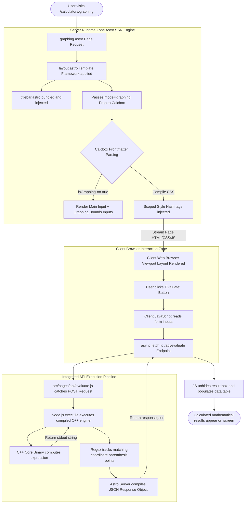

# `Arithmos Machine Front-End Architecture`

## Overview

Using Astro’s modern Component and Server-Side Rendering (SSR) architecture to unify UI layouts, component stylesheets, browser reactivity, and asynchronous backend routing into a single framework.

---

## Component Lifecycle & Architecture

The application UI is broken down into three component styles: **Global Styles**, **Layout Templates**, and **UI Components**.

### 1. Style Encapsulation (CSS)

Astro isolates presentation rules natively using a concept called **Scoped Styling**.

* **Global Boundary (`src/styles/global.css`)**: Injects universal rules across the entire application viewport, such as foundational document resets, background shades, and global fonts like *Red Hat Mono*.
* **Component Boundary (`is:scoped`)**: Every `<style>` tag written inside a `.astro` file is automatically scoped by the compiler. Astro hooks into the element tree and appends a unique cryptographic CSS class hash (e.g., `data-astro-cid-xxxxxx`) to the elements. This prevents CSS selectors in a specific module (like `.container` inside `calcbox.astro`) from leaking out or clashing with styles elsewhere.

### 2. Layout Layout Templating (`src/layouts/layout.astro`)

Acts as the central HTML framework skeleton for the portal. It implements the native `<slot />` placeholder.

* Individual page structures (`index.astro`, `scientific.astro`, `graphing.astro`) import this template and pass content down to fill it.
* Global navigation wrappers like the interactive `<Titlebar />` are declared once in this layout skeleton so they render identically across every application view.

---

## Data Communication Pipelines

Data travels through the application across two primary boundaries: **Component Props** (Server-to-Client during page rendering) and **API Routes** (Client-to-C++ Backend during evaluation executions).

### 1. Prop State Management (Top-Down Data Flow)

When a page calls a structural component, it passes data metrics configuration state downward using component frontmatter parameters.

* **Example Structure:** Changing view behavior between the Scientific and Graphing layout screens using a single component template file (`calcbox.astro`):

```astro
---
// src/components/calcbox.astro (Frontmatter Script Execution)
const { mode = "scientific" } = Astro.props;
const isGraphing = mode === "graphing";
---

{isGraphing && (
    <div class="graph-inputs">
        <input type="text" id="xMinInput" />
    </div>
)}

```

### 2. The Native Fetch Pipeline (Async Client-Server Bridge)

When a user targets a form interaction (like triggering a click on `#evaluateBtn`), a web-standard asynchronous transactional engine takes over.

* **Client Trigger:** The browser JavaScript collects the parameters from the active viewport elements (`#expressionInput`, `#xMinInput`, etc.) and streams them down to a unified local web API endpoint using an explicit HTTP POST transaction.
* **Unified API Handling (`src/pages/api/evaluate.js`)**: Astro captures the incoming request parameter map, intercepts the data payload natively, drops into a Node.js runtime process, and boots up the compiled C++ binary using `child_process::execFile`.
* **Response Population:** Once the binary calculations conclude, the standard text logging stream (`stdout`) is captured, tokenized into systematic array coordinate matrices (`points`), and fired back to the client as a JSON response to populate the UI results grid dynamically.

---

## Structural Control Flow

