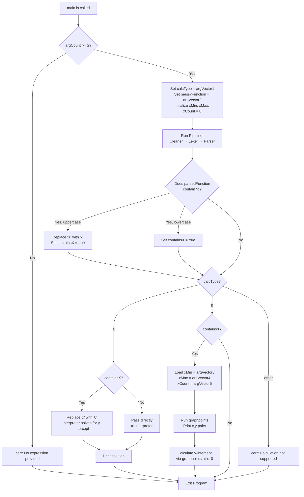

# `main.cpp`

## Engine Entry Point

`main.cpp` serves as the primary entry and exit point for all data interacting with the math engine. When the compiled binary is executed the core pipeline logic begins here. This file manages the execution and hands off data between the various modules of the engine:

Input String -> cleaner -> lexer -> parserast -> interpreter/graphpoints

It handles data normalization, tokenization, parsing, and evaluation. It also determines whether the expression requires graphing and routes the data accordingly.

---

## Interacting with the Compiled Binary

Arguments are passed to the executable via the command line interface (CLI).

```bash
./engine [calcType] "<expression>" [xMin xMax xCount]

```

The binary accepts up to **5 arguments** (using standard 0-indexed positioning):

* **Index 0:** The executable path (`./engine`).
* **Index 1:** The type of calculation to preform, s or g.
* **Index 2:** The mathematical expression or function of x to evaluate.
* **Indices 3, 4, 5 (Optional):** The minimum xvalue, maximum xvalue, and total count of points to calculate. These are required if the expression contains the variable x.

### Valid Argument Examples

* **Static Expression (No Variable):**
```bash
./engine s 12^3+4*5-2/3

```


* **Function of x (With Domain):**
```bash
./engine g 12x^3+4x+2/3 -100 100 200

```


*This evaluates the function at 200 evenly spaced points across the domain [-100, 100], including the bounds.*
* **Single-Point Evaluation:**
If you only need the result of a function at a single specific value (e.g., x = 24), set the minimum and maximum to that value and the count to `1`:
```bash
./engine g 12x^3+4x+2/3 24 24 1

```


---

### Web UI & Binary Integration Pipeline

The interaction loop between the Web UI frontend, the Node.js middleware, and the C++ binary follows a 6-step lifecycle:

```
                                            [Web UI (script.js)]  --(1. JSON Request)-->  [Middleware (server.js)]
                                                                                                    |
                                                                                            (2. Format Arguments)
                                                                                                    |
                                                                                                    v
[Web UI (script.js)]  <--(6. Render Data)--  [Middleware (server.js)] <--(3/4. std::cout)-- [C++ Binary]

```

1. **Event Capture:** When a user submits an expression, `script.js` intercepts the event, extracts the input data, packages it into a JSON payload, and sends an asynchronous `POST` request to the middleware at `/api/evaluate`.
2. **Middleware Parsing:** The Node.js server (`server.js`) processes the request and checks whether the expression contains the variable x. It then formats the payload into a command-line argument string compatible with the binary.
3. **Binary Execution:** The server spawns a child process to execute the compiled C++ binary, passing the formatted arguments.
4. **Data Capture:** * **If no x is present:** The server awaits and captures a single string output containing the solution.
* **If x is present:** The binary streams the calculated coordinates to standard output (`std::cout`) formatted as `(xValue, yValue)` for each point. The server captures this stream and pushes the points into an array.


5. **Payload Packaging:** The middleware formats the captured data (either a single result or an array of coordinates) back into a JSON object and sends it as a response to the client.
6. **Frontend Rendering:** `script.js` receives the JSON payload. It displays a static solution if no x was present, or populates a scrollable coordinate table if structured coordinate data was returned.

---

## Main Function Core Logic

Upon invocation, the `main` function executes the following pipeline:

### 1. Input Validation & Initialization

* Checks for the presence of arguments. If `argc < 2`, the program exits immediately.
* Assigns the raw expression input to `messyFunction`.
* Initializes variables (`xMin`, `xMax`, `xCount`) to `0`.

### 2. The Compilation Pipeline

* **Cleaning:** Passes `messyFunction` through the **cleaner** module, returning `cleanFunction`.
* **Lexing:** Passes `cleanFunction` to the **lexer**, returning `tokenizedFunction`.
* **Parsing:** Passes `tokenizedFunction` to the **parserast**, parsing the tokens with a multi pass reduction parser to get the correct order of operations (`parsedFunction`).

### 3. Evaluation Routing

The engine evaluates the parsedFunction to determine the execution path:

* **Static Execution Branch (Contains x is `false`):**
The parsedFunction is passed directly to the **interpreter**. The calculated result is caught as `solution`, printed to `std::cout`, and the program terminates.
* **Dynamic Execution Branch (Contains x is `true` and argCount = 5):**
If the engine verifies all 5 command-line arguments are present, it assigns the input arguments to the the domain variables (`xMin`, `xMax`, `xCount`).
* These variable and the parsedFunction are passed to the `graphpoints` function, which evaluates the parsedFunction iteratively and returns a vector of coordinate pairs.
* The coordinates are streamed out to the console.
* The engine also calculates the y-intercept (x=0) as `solution` before exiting.


### Error Handling & Diagnostics

* **Failure:** If an unhandled exception or parsing error occurs anywhere in the main pipeline, the application outputs a generic error to standard error (`std::cerr`): `"Please try again in a moment."`
* **Debug:** When the debug flag is true at compilation time, the engine overrides silent execution and prints verbose readouts of the expression at every stage of the pipeline, alongside internal math steps and outputs so the correctness can be verified.

## Visual

